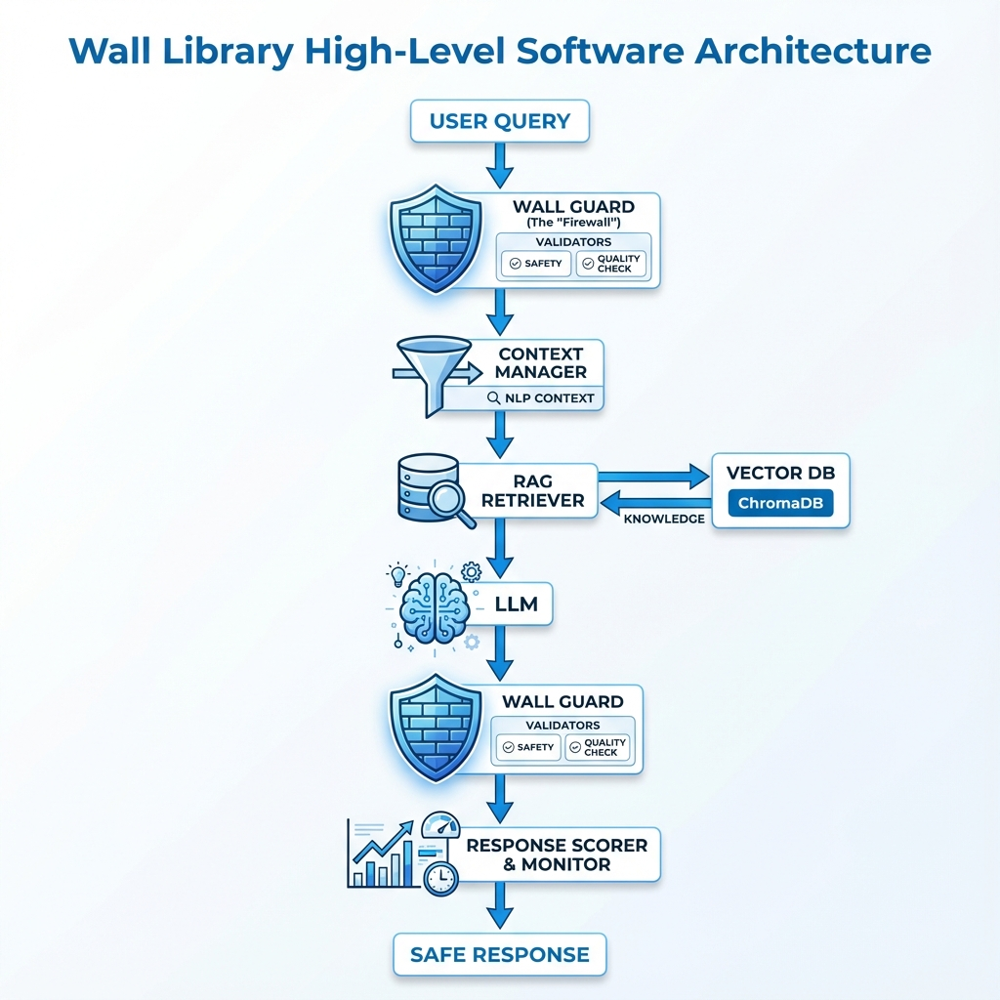
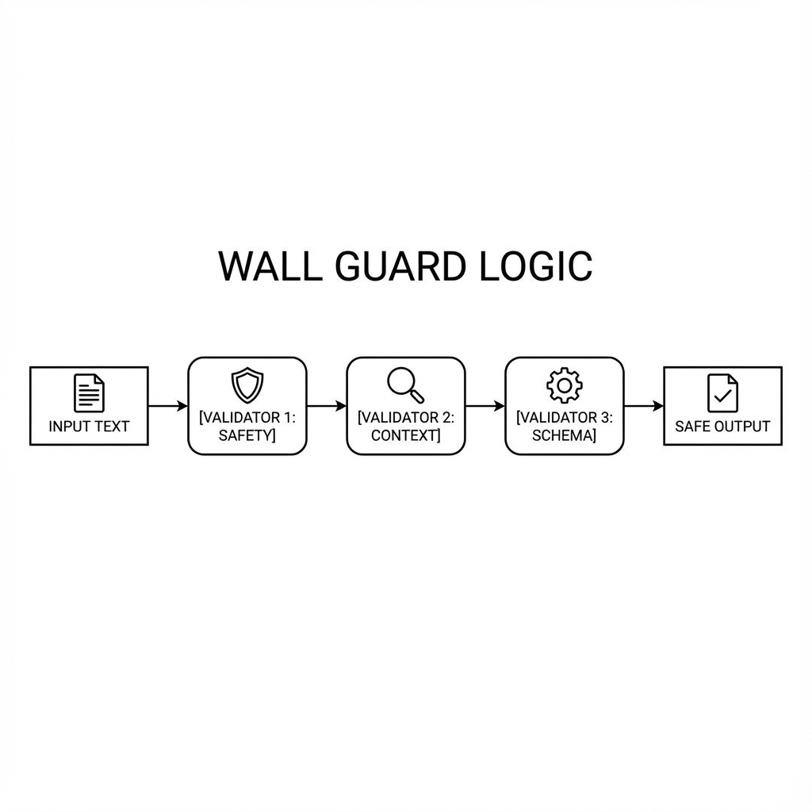
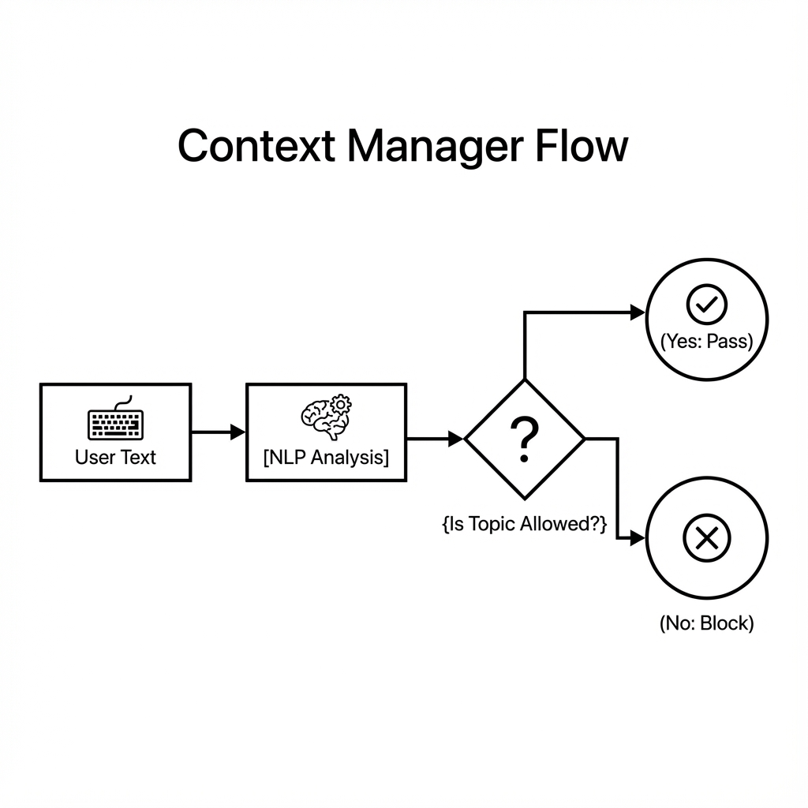
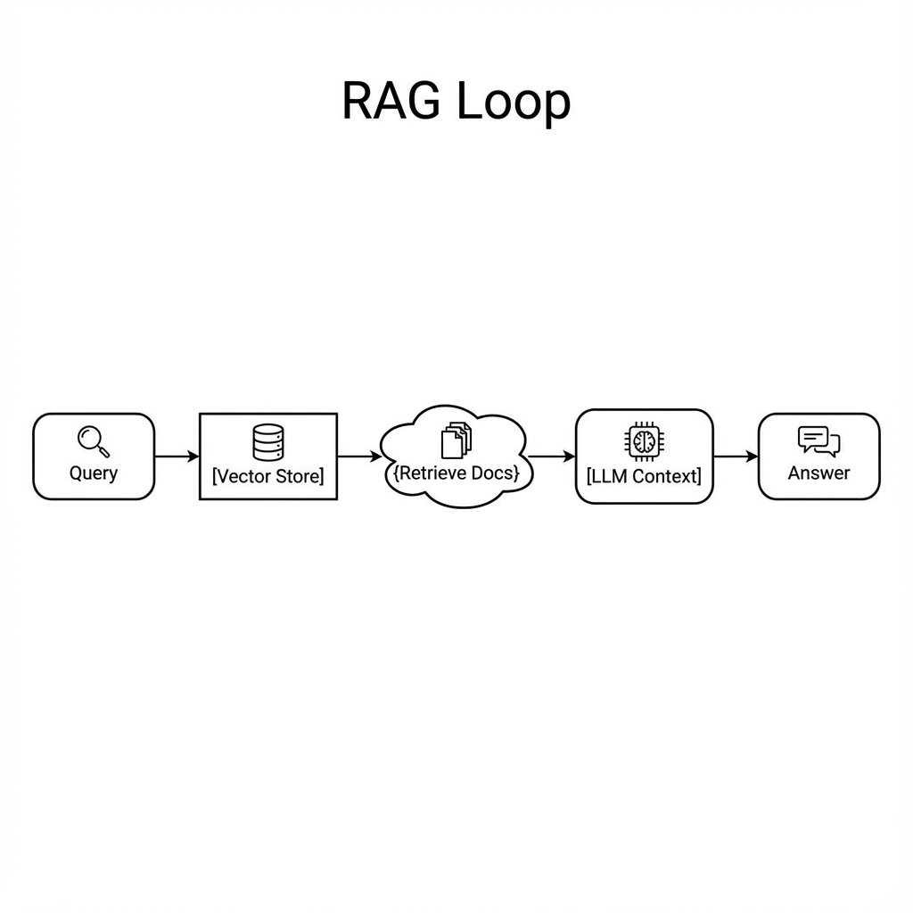
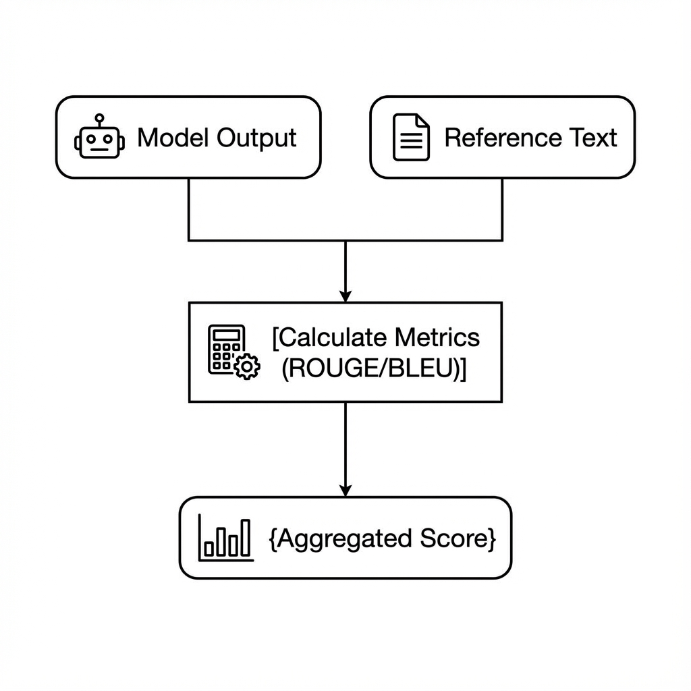

# Wall Library

<div align="center">

**Professional LLM Validation & Context Management**

[](https://www.python.org/downloads/)
[](https://opensource.org/licenses/MIT)
[](https://github.com/psf/black)

</div>

**Wall Library** is an enterprise-grade framework designed to act as a "firewall" for your Large Language Model (LLM) applications. It sits between your users and your LLM, ensuring safety, quality, and context compliance through advanced validation, NLP filtering, and RAG-based grounding.

---

## 🏗️ Architecture

The library operates as a multi-layered middleware, validating inputs and outputs at every stage of the LLM interaction lifecycle.



1.  **Wall Guard (Input)**: Validates user queries for safety and policy compliance.
2.  **Context Manager**: Filters requests based on approved topics and domains using NLP.
3.  **RAG Retriever**: Grounds the LLM with verified knowledge from your vector database (ChromaDB).
4.  **LLM Execution**: The model generates a response based on the sanitized input and context.
5.  **Wall Guard (Output)**: Validates the generated response for structure, safety, and quality.
6.  **Scoring & Monitoring**: Tracks performance metrics (ROUGE, BLEU, Latency) and logs interactions.

---

## 🚀 Detailed Features & Usage

### 🛡️ Wall Guard Logic

**Wall Guard** creates a secure pipeline for your LLM data. It chains multiple **Validators** together, and if any validator fails, an **OnFailAction** (like raising an exception or re-asking the LLM) is triggered.



**Key Components**:
-   **Validators**: Reusable rules (e.g., `MinLength`, `JsonSchema`, `ToxicityCheck`).
-   **OnFailAction**:
    -   `EXCEPTION`: Stop immediately.
    -   `REASK`: Ask the LLM to try again with feedback.
    -   `FIX`: Attempt to programmatically fix the output.

**Example**:
```python
from wall_library import WallGuard, OnFailAction
from wall_library.validator_base import Validator, register_validator, FailResult, PassResult

# 1. Define custom validators
@register_validator("no_sql_injection")
class SQLInjectionValidator(Validator):
    def _validate(self, value, metadata):
        if "DROP TABLE" in value.upper():
            return FailResult(error_message="Potential SQL Injection detected!")
        return PassResult()

# 2. Build the Guard
guard = WallGuard().use(
    (SQLInjectionValidator, {}, OnFailAction.EXCEPTION)
)

# 3. Validate
try:
    guard.validate("SELECT * FROM users; DROP TABLE users;")
except Exception as e:
    print(f"Blocked: {e}")
```

---

### 🧠 NLP Context Manager

**Context Manager** ensures your LLM stays "in lane". It uses an NLP engine to analyze the semantic meaning of user queries and LLM responses, blocking anything that deviates from your approved topics.



**Capabilities**:
-   **Keyword Matching**: Hard blocks on forbidden words.
-   **Semantic Similarity**: Soft blocks based on topic distance (using embeddings).
-   **Topic Lists**: Allow-lists for specific domains (e.g., "Healthcare", "Legal").

**Example**:
```python
from wall_library.nlp import ContextManager

# Initialize with approved topics
ctx = ContextManager()
ctx.add_keywords(["banking", "finance", "investment"])

# Check content
query = "How do I bake a cake?"
if not ctx.check_context(query):
     print("Blocked: Query is off-topic (not finance related).")
```

---

### 📚 RAG Retrieval Loop

**RAG (Retrieval-Augmented Generation)** connects your LLM to your private data. Wall Library includes a built-in RAG system powered by **ChromaDB**.



**Workflow**:
1.  **Query Embedding**: Convert user question to vector.
2.  **Vector Search**: Find nearest neighbors in ChromaDB.
3.  **Context Injection**: Retrieve top-k documents and feed them to the LLM.

**Example**:
```python
from wall_library.rag import ChromaDBClient, RAGRetriever

# 1. Setup Vector DB
db = ChromaDBClient(collection_name="company_policy")
db.add_docs(["Remote work is allowed on Fridays.", "Offices open at 9 AM."])

# 2. Retrieve
rag = RAGRetriever(chromadb_client=db)
context = rag.retrieve("When can I work from home?", top_k=1)

print(f"Retrieved Policy: {context[0]['document']}")
```

---

### 📊 Response Scoring & Metrics

**Response Scorer** provides quantitative quality control. It compares the LLM's actual output against a reference (ground truth) or uses reference-free metrics to assign a quality score.



**Supported Metrics**:
-   **ROUGE**: Measures n-gram overlap (great for summarization).
-   **BLEU**: Measures precision (great for translation).
-   **Cosine Similarity**: Measures semantic closeness.

**Example**:
```python
from wall_library.scoring import ResponseScorer

scorer = ResponseScorer()
actual = "Paris is the capital of France."
expected = "The capital of France is Paris."

# Calculate scores
scores = scorer.score(actual, expected)
print(f"ROUGE Score: {scores['rouge1']}")
```

---

## 📦 Installation

Since the library is currently in development/private, install it directly from the source or wheel.

### Basic Installation

```bash
pip install wall-library
```

### With Optional Dependencies

For specific features, install valid extras:

```bash
# For LangChain integration
pip install wall-library[langchain]

# For LangGraph integration
pip install wall-library[langgraph]

# For all optional features (recommended for dev)
pip install wall-library[all]
```

---

## 🤝 Contributing

Contributions are welcome! Please feel free to submit a Pull Request.

1. Fork the repository
2. Create your feature branch (`git checkout -b feature/AmazingFeature`)
3. Commit your changes (`git commit -m 'Add some AmazingFeature'`)
4. Push to the branch (`git push origin feature/AmazingFeature`)
5. Open a Pull Request
