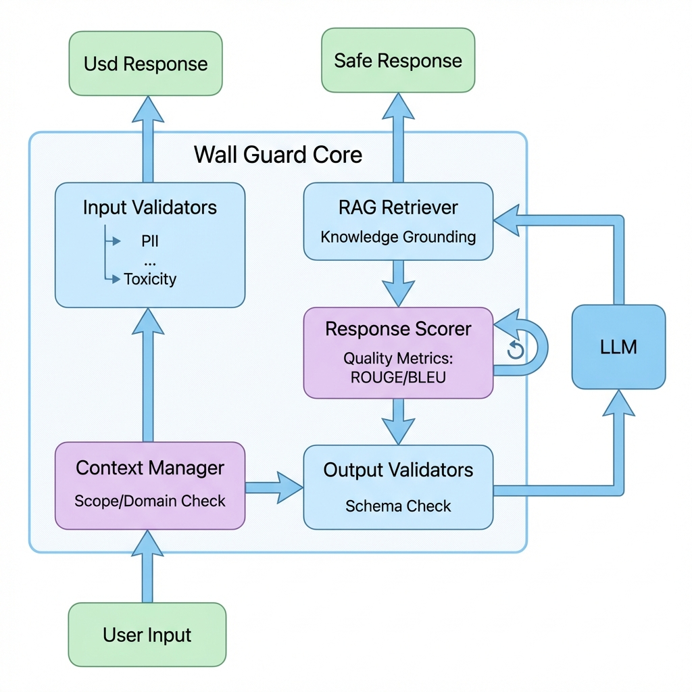

<div align="center">

# Wall Library

**Professional LLM Validation & Context Management Library**

[](https://www.python.org/downloads/)
[](https://opensource.org/licenses/Apache-2.0)
[](https://llmwall.dev/documentation)

<br />



**Enterprise-Grade Firewall for Your LLM Applications**

</div>

---

## 📋 Table of Contents

- [Overview](#overview)
- [Key Features](#key-features)
- [Installation](#installation)
- [Quick Start](#quick-start)
- [Detailed Feature Documentation](#detailed-feature-documentation)
  - [1. Wall Guard - Core Validation Engine](#1-wall-guard---core-validation-engine)
  - [2. Validators - Custom Validation Rules](#2-validators---custom-validation-rules)
  - [3. OnFailActions - Failure Handling Strategies](#3-onfailactions---failure-handling-strategies)
  - [4. Context Manager - NLP-Based Context Filtering](#4-context-manager---nlp-based-context-filtering)
  - [5. RAG Retriever - Knowledge Grounding](#5-rag-retriever---knowledge-grounding)
  - [6. Response Scorer - Quality Metrics](#6-response-scorer---quality-metrics)
  - [7. LLM Monitor - Tracking & Analytics](#7-llm-monitor---tracking--analytics)
  - [8. Wall Logger - Comprehensive Logging](#8-wall-logger---comprehensive-logging)
  - [9. Visualization - Visual Analytics](#9-visualization---visual-analytics)
  - [10. Schema Systems - Structured Output](#10-schema-systems---structured-output)
  - [11. Framework Wrappers - LangChain/LangGraph](#11-framework-wrappers---langchainlanggraph)
  - [12. Streaming & Async Support](#12-streaming--async-support)
- [Complete Examples](#complete-examples)
- [Architecture](#architecture)
- [Contributing](#contributing)
- [License](#license)

---

## Overview

**Wall Library** is a comprehensive Python framework that acts as a "firewall" for your Large Language Model (LLM) applications. It provides enterprise-grade validation, context filtering, RAG retrieval, response scoring, monitoring, and visualization to ensure your LLM applications are safe, accurate, and production-ready.

### Why Wall Library?

**Problem**: LLMs can generate:
- ❌ Dangerous or inappropriate content
- ❌ Information outside your domain boundaries
- ❌ Unstructured or incomplete responses
- ❌ Biased or inaccurate information
- ❌ Hallucinations and made-up facts

**Solution**: Wall Library provides:
- ✅ **Multi-layer validation** with custom validators
- ✅ **Context filtering** to keep responses in-bounds
- ✅ **RAG integration** for accurate, knowledge-grounded responses
- ✅ **Comprehensive monitoring** for production observability
- ✅ **Visual analytics** with 3D graphs and dashboards
- ✅ **Framework integration** (LangChain, LangGraph) for easy adoption

---

## Key Features

- 🛡️ **Wall Guard**: Multi-validator system with OnFailActions (EXCEPTION, REASK, FIX, FILTER, etc.)
- 🧠 **NLP Context Manager**: Semantic similarity and keyword-based context filtering
- 🔍 **RAG Integration**: ChromaDB-based knowledge retrieval with embedding services
- 📊 **Response Scoring**: ROUGE, BLEU, Cosine Similarity, Semantic Similarity metrics
- 📈 **LLM Monitoring**: Performance tracking, latency monitoring, OpenTelemetry integration
- 📝 **Comprehensive Logging**: Automatic logging of all operations (validation, RAG, scoring, LLM calls)
- 📊 **Visualization**: 3D graphs, word clouds, context boundaries, monitoring dashboards
- 📐 **Structured Output**: Pydantic, RAIL, JSON Schema support
- 🔗 **Framework Integration**: LangChain and LangGraph wrappers
- ⚡ **Streaming & Async**: Full support for streaming and asynchronous operations

---

## Installation

### Basic Installation

```bash
pip install wall-library
```

This automatically installs all core features including:
- Core Guard features with validators
- NLP context filtering (scikit-learn, sentence-transformers)
- RAG with ChromaDB (chromadb, rouge-score, nltk)
- Scoring metrics (ROUGE, BLEU, cosine similarity)
- Monitoring and OpenTelemetry
- Visualization (matplotlib, plotly, wordcloud)
- CLI tools and server (Flask)

### Optional Extras

```bash
# LangChain integration
pip install wall-library[langchain]

# LangGraph integration
pip install wall-library[langgraph]

# FAISS vector database
pip install wall-library[vectordb]

# All features
pip install wall-library[all]
```

See [INSTALLATION.md](INSTALLATION.md) for detailed instructions.

---

## Quick Start

### Basic Validation

```python
from wall_library import WallGuard, OnFailAction
from wall_library.validator_base import Validator, register_validator
from wall_library.classes.validation.validation_result import PassResult, FailResult

# Create custom validator
@register_validator("min_length")
class MinLengthValidator(Validator):
    def __init__(self, min_length: int = 10, **kwargs):
        super().__init__(require_rc=False, **kwargs)
        self.min_length = min_length
    
    def _validate(self, value: str, metadata: dict):
        if len(value) < self.min_length:
            return FailResult(
                error_message=f"Too short: {len(value)} < {self.min_length}",
                metadata=metadata
            )
        return PassResult(metadata=metadata)

# Use guard
guard = WallGuard().use(
    (MinLengthValidator, {"min_length": 10}, OnFailAction.EXCEPTION)
)

result = guard.validate("Hello World!")
print(result.validation_passed)  # True
```

---

## Detailed Feature Documentation

### 1. Wall Guard - Core Validation Engine

**Wall Guard** is the heart of Wall Library. It chains multiple validators together and executes them sequentially to validate LLM inputs and outputs.

#### How It Works

1. **Create Guard**: Initialize with validators
2. **Validate**: Run all validators on input/output
3. **Handle Results**: Apply OnFailAction based on validation results

#### Complete Example

```python
from wall_library import WallGuard, OnFailAction
from wall_library.validator_base import Validator, register_validator
from wall_library.classes.validation.validation_result import PassResult, FailResult

# Define safety validator
@register_validator("safety_check")
class SafetyValidator(Validator):
    def __init__(self, restricted_terms: list, **kwargs):
        super().__init__(require_rc=False, **kwargs)
        self.restricted_terms = restricted_terms
    
    def _validate(self, value: str, metadata: dict):
        value_lower = value.lower()
        for term in self.restricted_terms:
            if term.lower() in value_lower:
                return FailResult(
                    error_message=f"Contains restricted term: {term}",
                    metadata={**metadata, "restricted_term": term}
                )
        return PassResult(metadata=metadata)

# Define length validator
@register_validator("length_check")
class LengthValidator(Validator):
    def __init__(self, min_length: int = 50, max_length: int = 2000, **kwargs):
        super().__init__(require_rc=False, **kwargs)
        self.min_length = min_length
        self.max_length = max_length
    
    def _validate(self, value: str, metadata: dict):
        length = len(value)
        if length < self.min_length:
            return FailResult(
                error_message=f"Too short: {length} < {self.min_length}",
                metadata=metadata
            )
        if length > self.max_length:
            return FailResult(
                error_message=f"Too long: {length} > {self.max_length}",
                metadata=metadata
            )
        return PassResult(metadata=metadata)

# Create guard with multiple validators
guard = WallGuard().use(
    (SafetyValidator, {"restricted_terms": ["guaranteed cure", "miracle treatment"]}, OnFailAction.EXCEPTION)
).use(
    (LengthValidator, {"min_length": 50, "max_length": 2000}, OnFailAction.EXCEPTION)
)

# Validate response
response = "Common symptoms of diabetes include increased thirst and frequent urination."
result = guard.validate(response)

if result.validation_passed:
    print(f"✅ Validated: {result.validated_output}")
else:
    print(f"❌ Validation failed: {result.error_messages}")
```

#### Using Guard with LLM

```python
from openai import OpenAI

client = OpenAI(api_key="your-api-key")

def llm_api_call(prompt: str, **kwargs):
    response = client.chat.completions.create(
        model="gpt-3.5-turbo",
        messages=[{"role": "user", "content": prompt}],
        **kwargs
    )
    return response.choices[0].message.content

# Guard automatically calls LLM and validates response
raw_output, validated_output, outcome = guard(
    llm_api=llm_api_call,
    prompt="What are diabetes symptoms?"
)

print(f"Raw: {raw_output}")
print(f"Validated: {validated_output}")
print(f"Passed: {outcome.validation_passed}")
```

---

### 2. Validators - Custom Validation Rules

Validators define the rules for validating LLM responses. You can create custom validators or use built-in ones.

#### Creating Custom Validators

```python
from wall_library.validator_base import Validator, register_validator
from wall_library.classes.validation.validation_result import PassResult, FailResult

@register_validator("healthcare_safety")
class HealthcareSafetyValidator(Validator):
    """Validator to ensure healthcare responses don't contain restricted terms."""
    
    def __init__(self, restricted_terms: list = None, **kwargs):
        super().__init__(require_rc=False, **kwargs)
        self.restricted_terms = restricted_terms or [
            "guaranteed cure", "miracle treatment", "instant relief",
            "100% effective", "bypass doctor", "self-diagnose"
        ]
    
    def _validate(self, value: Any, metadata: dict) -> PassResult | FailResult:
        if not isinstance(value, str):
            return FailResult(
                error_message="Response must be a string",
                metadata=metadata,
            )
        
        value_lower = value.lower()
        found_restricted = []
        
        for term in self.restricted_terms:
            if term.lower() in value_lower:
                found_restricted.append(term)
        
        if found_restricted:
            return FailResult(
                error_message=f"Response contains restricted healthcare terms: {', '.join(found_restricted)}",
                metadata={**metadata, "restricted_terms": found_restricted},
            )
        
        return PassResult(metadata=metadata)

# Use validator
guard = WallGuard().use(
    (HealthcareSafetyValidator, {"restricted_terms": ["guaranteed cure"]}, OnFailAction.EXCEPTION)
)
```

#### Validator Features

- **Reusable**: Register once, use anywhere
- **Configurable**: Pass parameters via constructor
- **Metadata Support**: Include additional context in results
- **Error Messages**: Detailed failure information

---

### 3. OnFailActions - Failure Handling Strategies

OnFailActions define what happens when validation fails.

#### Available Actions

```python
from wall_library import OnFailAction

# EXCEPTION: Raise error (strictest)
guard.use((Validator, {}, OnFailAction.EXCEPTION))

# FILTER: Remove invalid content
guard.use((Validator, {}, OnFailAction.FILTER))

# REFRAIN: Return empty/default response
guard.use((Validator, {}, OnFailAction.REFRAIN))

# REASK: Re-ask LLM to generate new response
guard.use((Validator, {}, OnFailAction.REASK))

# FIX: Attempt to fix invalid content
guard.use((Validator, {}, OnFailAction.FIX))

# FIX_REASK: Try to fix, then reask if fix fails
guard.use((Validator, {}, OnFailAction.FIX_REASK))

# NOOP: Pass through invalid content (no validation)
guard.use((Validator, {}, OnFailAction.NOOP))
```

#### Complete Example

```python
from wall_library import WallGuard, OnFailAction

# Guard with different OnFailActions
guard = WallGuard()

# Strict: Raise exception on safety violations
guard.use((SafetyValidator, {}, OnFailAction.EXCEPTION))

# Moderate: Filter out invalid length responses
guard.use((LengthValidator, {}, OnFailAction.FILTER))

# Lenient: Re-ask LLM if quality is low
guard.use((QualityValidator, {}, OnFailAction.REASK))

# Use guard
try:
    result = guard.validate(response)
    if result.validation_passed:
        print(f"✅ Valid: {result.validated_output}")
except Exception as e:
    print(f"❌ Blocked: {e}")
```

---

### 4. Context Manager - NLP-Based Context Filtering

**Context Manager** ensures LLM responses stay within approved context boundaries using NLP techniques.

#### How It Works

1. **Define Approved Contexts**: Keywords, strings, or files
2. **Check Similarity**: Uses embeddings and cosine similarity
3. **Keyword Matching**: Exact/fuzzy keyword matching
4. **Return Result**: True if within context, False otherwise

#### Complete Example

```python
from wall_library.nlp import ContextManager

# Initialize context manager
context_manager = ContextManager()

# Add keywords
context_manager.add_keywords([
    "healthcare", "medical", "doctor", "patient", "symptom",
    "diagnosis", "treatment", "medication", "prescription"
])

# Add approved context strings
context_manager.add_string_list([
    "General health information and wellness tips",
    "Symptom description and when to seek medical attention",
    "Medication information and dosage instructions from approved sources",
    "Medical terminology and definitions",
    "Healthcare facility information and appointment scheduling"
])

# Load from file
context_manager.load_from_file("approved_contexts.txt")

# Check if response is in context
response = "Common symptoms of diabetes include increased thirst and frequent urination."
is_valid = context_manager.check_context(response, threshold=0.7)

if is_valid:
    print("✅ Response is within approved healthcare context")
else:
    print("❌ Response is outside approved context boundaries")
```

#### Advanced Usage

```python
# Check multiple responses
responses = [
    "Diabetes symptoms include increased thirst and frequent urination.",
    "This is a guaranteed cure for diabetes that will definitely work.",
    "Blood pressure medications should be taken as prescribed."
]

for response in responses:
    is_valid = context_manager.check_context(response, threshold=0.7)
    status = "✅ IN" if is_valid else "❌ OUT"
    print(f"{status}: {response[:50]}...")
```

---

### 5. RAG Retriever - Knowledge Grounding

**RAG Retriever** retrieves relevant knowledge from a vector database to ground LLM responses in verified information.

#### How It Works

1. **Store Knowledge**: Add Q&A pairs to ChromaDB
2. **Query**: Embed query and search vector database
3. **Retrieve**: Get top-k most relevant contexts
4. **Use in LLM**: Include retrieved context in LLM prompt

#### Complete Example

```python
from wall_library.rag import ChromaDBClient, RAGRetriever, EmbeddingService
import tempfile

# Create temporary directory for ChromaDB
temp_dir = tempfile.mkdtemp()

# Initialize components
chromadb_client = ChromaDBClient(
    collection_name="healthcare_knowledge_base",
    persist_directory=temp_dir
)

embedding_service = EmbeddingService(provider="sentence-transformers")

rag_retriever = RAGRetriever(
    chromadb_client=chromadb_client,
    embedding_service=embedding_service,
    top_k=5
)

# Add knowledge base
questions = [
    "What are common symptoms of diabetes?",
    "How should I take my blood pressure medication?",
    "What preventive screenings should I get?",
    "What are signs of anxiety?",
    "How do I manage chronic pain?"
]

answers = [
    "Common symptoms of diabetes include increased thirst, frequent urination, unexplained weight loss, fatigue, and blurred vision. Consult a healthcare provider for proper diagnosis.",
    "Blood pressure medications should be taken exactly as prescribed by your doctor, usually at the same time each day. Never stop taking medication without consulting your healthcare provider.",
    "Preventive screenings vary by age and risk factors but typically include blood pressure checks, cholesterol tests, cancer screenings, and diabetes screening. Consult your doctor for personalized recommendations.",
    "Signs of anxiety include excessive worry, restlessness, difficulty concentrating, sleep problems, and physical symptoms like rapid heartbeat. Seek professional help if symptoms persist.",
    "Chronic pain management involves a combination of medical treatment, physical therapy, lifestyle modifications, and sometimes psychological support. Work with your healthcare team to develop a comprehensive plan."
]

# Add to ChromaDB
metadata = [
    {"type": "healthcare_qa", "index": i, "domain": "healthcare"}
    for i in range(len(questions))
]

chromadb_client.add_qa_pairs(
    questions=questions,
    answers=answers,
    metadata=metadata
)

# Retrieve relevant context
query = "What are diabetes symptoms?"
retrieved = rag_retriever.retrieve(query, top_k=3)

print(f"Retrieved {len(retrieved)} relevant contexts:")
for i, result in enumerate(retrieved, 1):
    print(f"\n[{i}] Score: {result['score']:.3f}")
    print(f"    Document: {result['document'][:100]}...")
    print(f"    Metadata: {result['metadata']}")

# Use in LLM prompt
if retrieved:
    context = retrieved[0]['document']
    prompt = f"Context: {context}\n\nQuestion: {query}"
    # Now use prompt with your LLM
```

---

### 6. Response Scorer - Quality Metrics

**Response Scorer** evaluates LLM responses against expected outputs using multiple metrics.

#### Available Metrics

- **CosineSimilarityMetric**: Vector similarity
- **SemanticSimilarityMetric**: Semantic meaning similarity
- **ROUGEMetric**: Overlap-based metric (recall-oriented)
- **BLEUMetric**: Precision-based metric

#### Complete Example

```python
from wall_library.scoring import ResponseScorer, ROUGEMetric, BLEUMetric

# Create scorer
scorer = ResponseScorer()

# Add metrics
scorer.metrics.append(ROUGEMetric())
scorer.metrics.append(BLEUMetric())

# Score response
response = "Common symptoms of diabetes include increased thirst, frequent urination, and fatigue."
expected = "Diabetes symptoms include increased thirst, frequent urination, unexplained weight loss, fatigue, and blurred vision. Consult a healthcare provider for proper diagnosis."

scores = scorer.score(response, expected)
print("Individual Scores:")
for metric_name, score in scores.items():
    print(f"  {metric_name}: {score:.3f}")

# Aggregate score
aggregated = scorer.aggregate_score(scores)
print(f"\nAggregated Score: {aggregated:.3f}")

# Score against approved context boundaries
approved_contexts = [
    "General health information and wellness tips",
    "Symptom description and when to seek medical attention",
    "Medication information and dosage instructions"
]
approved_text = "\n".join(approved_contexts)

scores = scorer.score(response, approved_text)
print("\nScores against approved contexts:")
for metric_name, score in scores.items():
    print(f"  {metric_name}: {score:.3f}")
```

---

### 7. LLM Monitor - Tracking & Analytics

**LLM Monitor** tracks all LLM interactions for monitoring and analytics.

#### Complete Example

```python
from wall_library.monitoring import LLMMonitor

# Create monitor
monitor = LLMMonitor()

# Track LLM calls
for i in range(10):
    monitor.track_call(
        input_data=f"What are diabetes symptoms?",
        output=f"Common symptoms include increased thirst and frequent urination. [Response {i}]",
        metadata={
            "model": "gpt-3.5-turbo",
            "domain": "healthcare",
            "iteration": i
        },
        latency=0.3 + (i * 0.1)
    )

# Get statistics
stats = monitor.get_stats()
print(f"Total Interactions: {stats['total_interactions']}")
print(f"Metrics: {stats['metrics']}")

# Access individual interactions
for interaction in monitor.interactions:
    print(f"Input: {interaction['input'][:50]}...")
    print(f"Output: {interaction['output'][:50]}...")
    print(f"Latency: {interaction['latency']}s")
    print(f"Metadata: {interaction['metadata']}")
    print("-" * 50)
```

---

### 8. Wall Logger - Comprehensive Logging

**Wall Logger** provides automatic logging of all Wall Library operations.

#### Complete Example

```python
from wall_library.logging import WallLogger, LogScope
import os

# Create logger
log_dir = os.path.join(os.getcwd(), "logs")
os.makedirs(log_dir, exist_ok=True)
log_file = os.path.join(log_dir, "wall_library.log")

logger = WallLogger(
    level="INFO",
    scopes=[LogScope.ALL.value],  # Log everything
    output="both",  # File + console
    format="both",  # JSON + human-readable
    log_file=log_file
)

# Set logger on components (automatic logging)
guard.set_logger(logger)
rag_retriever.set_logger(logger)
scorer.set_logger(logger)
monitor.set_logger(logger)

# Now all operations are automatically logged:
# - Validation operations
# - RAG retrievals
# - Scoring operations
# - LLM calls
# - Monitoring events
```

---

### 9. Visualization - Visual Analytics

**Visualization** module provides comprehensive visual analytics including 3D graphs, word clouds, and dashboards.

#### Complete Example

```python
from wall_library.visualization import WallVisualizer

# Create visualizer
viz = WallVisualizer(output_dir="visualizations")

# 1. Visualize scores
scores = {
    "CosineSimilarity": 0.85,
    "ROUGEMetric": 0.72,
    "BLEUMetric": 0.68,
    "SemanticSimilarity": 0.79
}
viz.visualize_scores(scores, title="Response Quality Scores")

# 2. Visualize context boundaries
responses = [
    "Common symptoms of diabetes include increased thirst and frequent urination.",
    "This is a guaranteed cure for diabetes that will definitely work.",
    "Blood pressure medications should be taken as prescribed."
]
viz.visualize_context_boundaries(responses, context_manager)

# 3. Generate word cloud
text = "healthcare medical doctor patient symptom diagnosis treatment medication prescription"
viz.visualize_wordcloud(text, title="Healthcare Domain Word Cloud")

# 4. 3D Embeddings Visualization (IMPORTANT!)
import numpy as np
embeddings = np.random.rand(20, 384).tolist()  # 384-dim embeddings
labels = [
    {
        "label": f"Response {i+1}",
        "text": f"Sample healthcare response text {i+1}",
        "keywords": ["healthcare", "medical", "patient"],
        "metadata": {"domain": "healthcare", "index": i}
    }
    for i in range(20)
]
viz.visualize_3d_embeddings(embeddings, labels, title="3D Embedding Space")

# 5. 3D Scores Visualization (IMPORTANT!)
scores_data = [
    {
        "CosineSimilarity": 0.85,
        "ROUGEMetric": 0.72,
        "BLEUMetric": 0.68,
        "label": "Diabetes Symptoms Response",
        "text": "Common symptoms of diabetes include increased thirst, frequent urination, unexplained weight loss, fatigue, and blurred vision.",
        "keywords": ["diabetes", "symptoms", "thirst", "urination", "fatigue"],
        "metadata": {"domain": "healthcare", "topic": "diabetes"}
    },
    {
        "CosineSimilarity": 0.92,
        "ROUGEMetric": 0.88,
        "BLEUMetric": 0.85,
        "label": "Preventive Screenings",
        "text": "Preventive screenings vary by age and risk factors but typically include blood pressure checks, cholesterol tests, cancer screenings.",
        "keywords": ["preventive", "screening", "blood pressure", "cholesterol"],
        "metadata": {"domain": "healthcare", "topic": "prevention"}
    }
]
viz.visualize_3d_scores(
    scores_data,
    x_metric="CosineSimilarity",
    y_metric="ROUGEMetric",
    z_metric="BLEUMetric",
    title="3D Score Space Visualization"
)

# 6. Monitoring dashboard
monitor_data = {
    "total_interactions": 150,
    "success_rate": 0.92,
    "avg_latency": 0.45,
    "latencies": [0.3, 0.4, 0.5, 0.6, 0.4] * 30,
    "errors": {
        "ValidationError": 5,
        "TimeoutError": 3,
        "NetworkError": 2
    },
    "metrics": {
        "total_tokens": 45000,
        "avg_response_length": 250,
        "cache_hit_rate": 0.35
    }
}
viz.visualize_monitoring_dashboard(monitor_data)
```

---

### 10. Schema Systems - Structured Output

**Schema Systems** ensure LLM outputs match expected structure using Pydantic, RAIL, or JSON Schema.

#### Pydantic Example

```python
from wall_library import WallGuard
from pydantic import BaseModel, Field

class PatientInfo(BaseModel):
    condition: str = Field(description="Medical condition or diagnosis")
    symptoms: list[str] = Field(description="List of symptoms")
    severity: str = Field(description="Severity level: mild, moderate, or severe")
    recommendation: str = Field(description="Recommended action")

# Create guard with Pydantic schema
guard = WallGuard.for_pydantic(output_class=PatientInfo, prompt="Extract patient information")

# Use with LLM
raw, validated, outcome = guard(llm_api=llm_call, prompt="Patient has diabetes with symptoms of increased thirst")

if outcome.validation_passed:
    print(f"Condition: {validated['condition']}")
    print(f"Symptoms: {validated['symptoms']}")
    print(f"Severity: {validated['severity']}")
    print(f"Recommendation: {validated['recommendation']}")
```

#### RAIL Schema Example

```python
from wall_library.schema.rail_schema import rail_string_to_schema

rail_schema = """
<rail version="0.1">
<output>
    <string name="symptom_description" 
            description="Patient symptom description" 
            validators="length" 
            on-fail-length="exception"/>
    <string name="recommendation" 
            description="General health recommendation" 
            validators="length" 
            on-fail-length="exception"/>
</output>
<prompt>
You are a healthcare assistant. Provide symptom information and recommendations.
</prompt>
</rail>
"""

# Parse and use RAIL schema
processed_schema = rail_string_to_schema(rail_schema)
guard = WallGuard()
guard.processed_schema = processed_schema
```

---

### 11. Framework Wrappers - LangChain/LangGraph

**Framework Wrappers** make Wall Library guards usable in LangChain and LangGraph workflows.

#### LangChain Integration

```python
from wall_library import WallGuard
from wall_library.wrappers import LangChainWrapper
from openai import OpenAI

# Create guard
guard = WallGuard().use(
    (SafetyValidator, {}, OnFailAction.EXCEPTION)
).use(
    (LengthValidator, {"min_length": 50}, OnFailAction.EXCEPTION)
)

# Convert to LangChain runnable
wrapper = LangChainWrapper(guard)
runnable = wrapper.to_runnable()

# Create LLM API callable
client = OpenAI(api_key="your-api-key")

def llm_api_call(prompt: str, **kwargs):
    response = client.chat.completions.create(
        model="gpt-3.5-turbo",
        messages=[{"role": "user", "content": prompt}],
        **kwargs
    )
    return response.choices[0].message.content

# Use runnable
result = runnable.invoke({
    "prompt": "What are diabetes symptoms?",
    "llm_api": llm_api_call
})

print(f"Validated output: {result['output']}")
```

#### LangGraph Integration

```python
from wall_library.wrappers import LangGraphWrapper

guard = WallGuard().use(...)
wrapper = LangGraphWrapper(guard)

# Create node with guard validation
node = wrapper.create_node("validate_node")

# Use in LangGraph workflow
# (LangGraph setup code here)
```

---

### 12. Streaming & Async Support

Wall Library supports both streaming and asynchronous operations.

#### Streaming Example

```python
from wall_library.run import StreamRunner

def llm_api_stream(prompt: str, **kwargs):
    # Your streaming LLM API
    for chunk in llm.stream(prompt):
        yield chunk

stream_runner = StreamRunner(
    api=llm_api_stream,
    validation_map=guard.validator_map
)

# Stream validated chunks
for chunk in stream_runner.stream("What are diabetes symptoms?"):
    print(chunk, end="", flush=True)
```

#### Async Example

```python
from wall_library import AsyncGuard

async_guard = AsyncGuard()
async_guard.use((SafetyValidator, {}, OnFailAction.EXCEPTION))

# Async validation
outcome = await async_guard.async_validate(response)

# Async guard with LLM
async def async_llm_api(prompt: str, **kwargs):
    # Your async LLM API
    return await llm.agenerate(prompt)

raw, validated, outcome = await async_guard(
    llm_api=async_llm_api,
    prompt="What are diabetes symptoms?"
)
```

---

## Complete Examples

### Healthcare Domain Example

See [examples/domain_tests/healthcare_test.py](examples/domain_tests/healthcare_test.py) for a complete healthcare domain example demonstrating all features.

### End-to-End Example

```python
from wall_library import WallGuard, OnFailAction
from wall_library.nlp import ContextManager
from wall_library.rag import RAGRetriever, ChromaDBClient
from wall_library.scoring import ResponseScorer
from wall_library.monitoring import LLMMonitor
from wall_library.logging import WallLogger, LogScope
from wall_library.visualization import WallVisualizer

# 1. Setup logger
logger = WallLogger(scopes=[LogScope.ALL.value], output="file", log_file="app.log")

# 2. Create guard
guard = WallGuard()
guard.use((SafetyValidator, {}, OnFailAction.EXCEPTION))
guard.use((LengthValidator, {"min_length": 50}, OnFailAction.EXCEPTION))
guard.set_logger(logger)

# 3. Create context manager
context_manager = ContextManager()
context_manager.add_keywords(["healthcare", "medical"])

# 4. Create RAG retriever
rag = RAGRetriever(chromadb_client=ChromaDBClient())
rag.set_logger(logger)

# 5. Create scorer
scorer = ResponseScorer()
scorer.set_logger(logger)

# 6. Create monitor
monitor = LLMMonitor()
monitor.set_logger(logger)

# 7. Create visualizer
viz = WallVisualizer(output_dir="visualizations")

# 8. Process query
def process_query(query: str):
    # Retrieve context
    contexts = rag.retrieve(query, top_k=3)
    
    # Build prompt
    prompt = f"Context: {contexts[0]['document']}\n\nQuery: {query}"
    
    # Call LLM
    llm_response = llm.generate(prompt)
    
    # Validate
    result = guard.validate(llm_response)
    if not result.validation_passed:
        raise ValueError("Validation failed")
    
    # Check context
    if not context_manager.check_context(llm_response):
        raise ValueError("Response outside context")
    
    # Score
    scores = scorer.score(llm_response, contexts[0]['document'])
    
    # Monitor
    monitor.track_call(input_data=query, output=llm_response, metadata={"rag_used": True})
    
    # Visualize
    viz.visualize_scores(scores)
    
    return result.validated_output
```

---

## Architecture

```
User Query
    ↓
[Wall Guard] ← Validators check safety/quality
    ↓
[Context Manager] ← Checks if response is in approved context
    ↓
[RAG Retriever] ← Retrieves relevant knowledge (optional)
    ↓
[LLM] ← Generates response
    ↓
[Wall Guard] ← Validates response
    ↓
[Response Scorer] ← Scores response quality
    ↓
[LLM Monitor] ← Tracks interaction
    ↓
[Visualization] ← Creates visual analytics
    ↓
Validated Safe Response
```

---

## 🤝 Contributing

We welcome contributions! Please see our [Contributing Guide](CONTRIBUTING.md) for details on how to submit pull requests, report issues, and our code of conduct.

---

## 📄 License

This project is licensed under the Apache License 2.0 - see the [LICENSE](LICENSE) file for details.

---

**Wall Library** - Building safe, reliable LLM applications since 2024.
