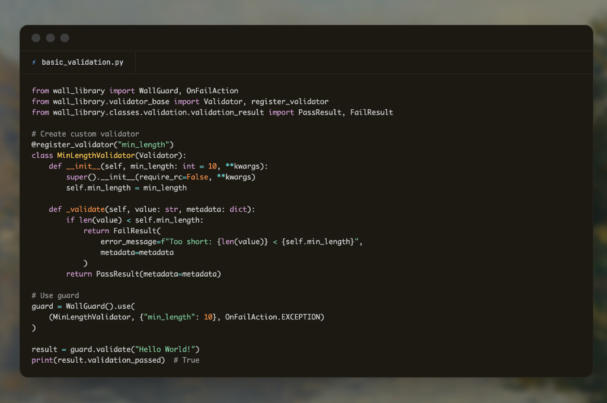

# LLMWall



**Professional LLM Validation & Context Management Library**

[](https://www.python.org/downloads/)
[](https://opensource.org/licenses/Apache-2.0)
[](https://pypi.org/project/wall-library/)
[](https://github.com/hritvikgupta/wall)

**Enterprise-Grade Firewall for Your LLM Applications**

---

## Overview

**LLMWall** (distributed as `wall-library`) is a comprehensive Python framework that acts as a "firewall" for your Large Language Model (LLM) applications. It provides enterprise-grade validation, context filtering, RAG retrieval, response scoring, monitoring, and visualization to ensure your LLM applications are safe, accurate, and production-ready.

## Key Features

- 🛡️ **Wall Guard**: Multi-validator system with OnFailActions (EXCEPTION, REASK, FIX, FILTER, etc.)
- 🧠 **NLP Context Manager**: Semantic similarity and keyword-based context filtering
- 🔍 **RAG Integration**: ChromaDB-based knowledge retrieval with embedding services
- 📊 **Response Scoring**: ROUGE, BLEU, Cosine Similarity, Semantic Similarity metrics
- 📈 **LLM Monitoring**: Performance tracking, latency monitoring, OpenTelemetry integration
- 📝 **Comprehensive Logging**: Automatic logging of all operations
- 📊 **Visualization**: 3D graphs, word clouds, context boundaries
- 🔗 **Framework Integration**: LangChain and LangGraph wrappers

## Installation

```bash
pip install wall-library
```

## Quick Start

```python
from wall_library import WallGuard, OnFailAction
from wall_library.validator_base import Validator, register_validator
from wall_library.classes.validation.validation_result import PassResult, FailResult

# Create custom validator
@register_validator("min_length")
class MinLengthValidator(Validator):
    def __init__(self, min_length: int = 10, **kwargs):
        super().__init__(require_rc=False, **kwargs)
        self.min_length = min_length
    
    def _validate(self, value: str, metadata: dict):
        if len(value) < self.min_length:
            return FailResult(error_message=f"Too short", metadata=metadata)
        return PassResult(metadata=metadata)

# Use guard
guard = WallGuard().use(
    (MinLengthValidator, {"min_length": 10}, OnFailAction.EXCEPTION)
)

result = guard.validate("Hello World!")
print(result.validation_passed)  # True
```

## Contributing

We welcome contributions! Please see [CONTRIBUTING.md](CONTRIBUTING.md) for details on how to submit pull requests, report issues, and our code of conduct.

## License

This project is licensed under the Apache 2.0 License - see the [LICENSE](LICENSE) file for details.

Copyright 2026 Hritvik Gupta.
